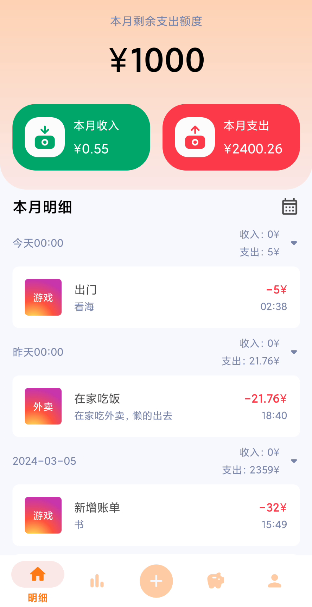

# BillTracker - 账本App

## 项目背景

账本App的开发旨在满足用户对个人财务管理的迫切需求。在移动设备普及的背景下，人们对通过智能终端快速记录财务信息、监控开支情况以及生成统计分析报告的需求日益增长。用户希望拥有一款功能丰富、操作便捷且安全可靠的财务管理工具，以便更高效地掌控个人财务状况。因此，账本App应运而生，其核心理念是通过技术手段为用户提供更加科学合理的财务管理方式，目标用户包括需要高效管理财务的个人及小型团队。

## 程序概述

本项目主要运行于Android移动平台，采用Kotlin和Java编程语言进行开发并使用了现代MVVM架构。程序的开发利用了Hilt实现依赖注入，集成了Retrofit用于网络请求，并结合协程以优化异步任务的处理效率，确保在提升开发效率的同时，显著提高代码的可读性和维护性。同时，项目还需要集成在线API以实现实时地理位置获取与同步功能，进一步提升了用户体验。

## 部分运行截图

以下为账本App运行中的部分截图：

1. 主界面

   

2. 添加账单界面

   

3. 地图选点界面

   

4. 账户界面

   
